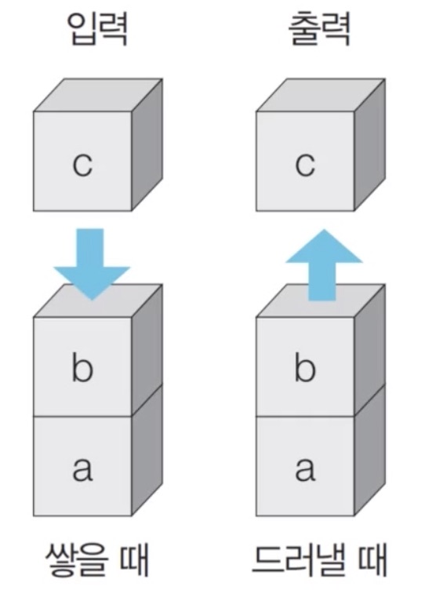
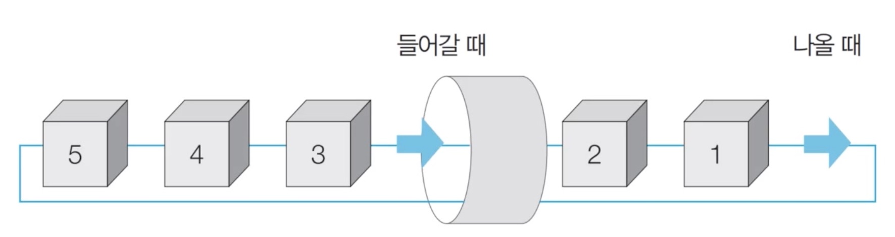

# stack(스택)
- 선입후출의 자료구조 
- 입구와 출구가 동일한 형태로 시각화(예시:박스 쌓기)


- 삽입과 삭제의 동작으로 구성됨
    - python
    ```python
    stack.append() 
    => stack에 원소 추가

    stack.pop()
    => stack에서 원소 빼기

    print(stack[::-1])
    => 집어넣은 역순으로 출력
    print(stack)
    => 집어넣은 순서대로 출력
    ```

# queue(큐)
- 선입선출의 자료구조
- 입구와 출구가 모두 뚫린 터널같은 형태


- python
```python
from collections import deque
=> 리스트로 구현가능하지만 효율을 위해 deque 사용할 것

queue.append() 
=> queue에 원소 추가

queue.popleft()
=> queue에서 원소 빼기

print(queue)
=> 집어넣은 순서대로 출력

queue.reverse()
=> 뒤집기

print(queue)
=> 집어넣은 역순으로 출력
```