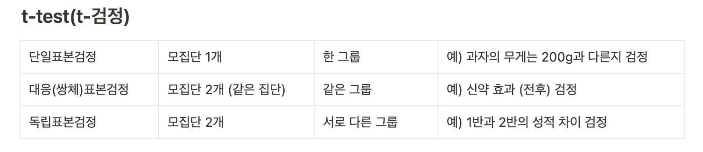
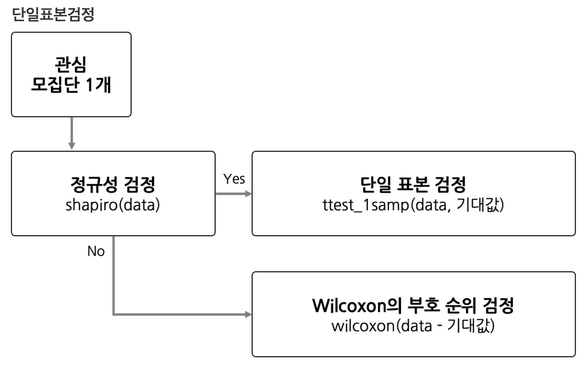
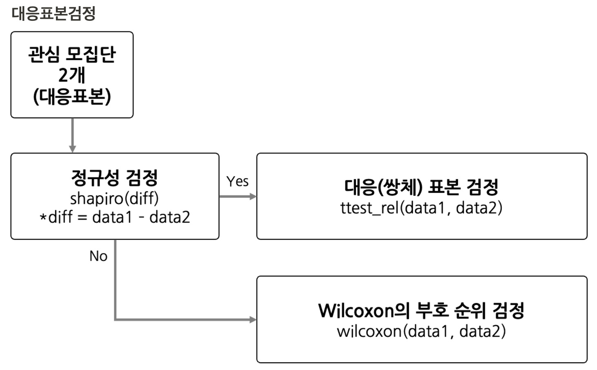
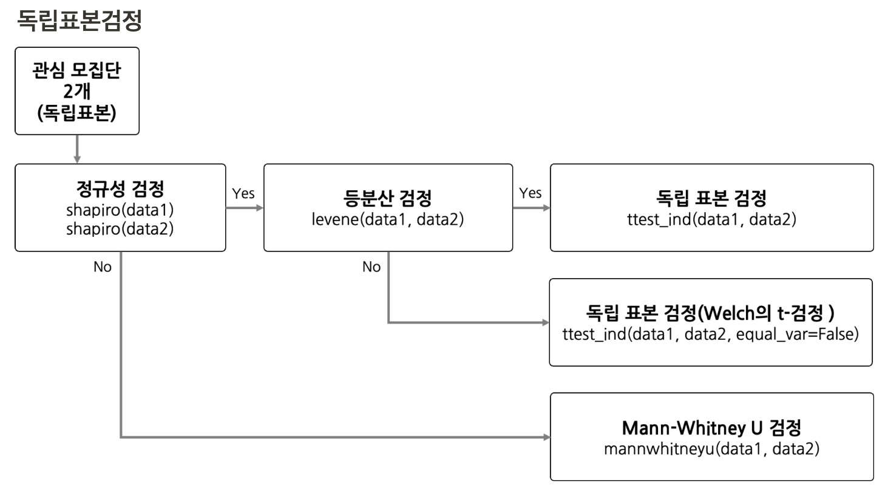

# 가설검정
- 강의 내용

### **모집단과 표본**

- 모집단: 연구 대상이 되는 전체 집단
- 표본: 모집단의 일부

### 귀무가설과 대립가설

- 귀무가설: 기존에 알려진 사실, 효과나 차이가 없음
    - 퇴근후딴짓 강의 수강생과 타 강의 수강생과 합격률 차이가 없다.
- 대립가설: 연구자가 입증 하려는 사실, 효과나 차이가 있음
    - 퇴근후딴짓 강의 수강생은 타 강의 수강생보다 합격률이 높다

### **검정 결과**

- 검정통계량: 주어진 데이터와 귀무가설 간의 차이를 통계적으로 나타내는 값
- p-value (유의수준 0.05)
    - 유의수준보다 작으면 **귀무가설을 기각**하고, 대립가설을 채택한다.
    - 유의수준보다 크면 귀무가설을 기각하지 못한다.(**귀무가설 채택**)
    

### 가설검정 프로세스

- 통계적 가설 설정: 귀무가설과 대립가설
- 유의수준 결정: 예) 0.05
- 검정 통계량 및 p-value(유의확률) 계산
- 결과 도출

