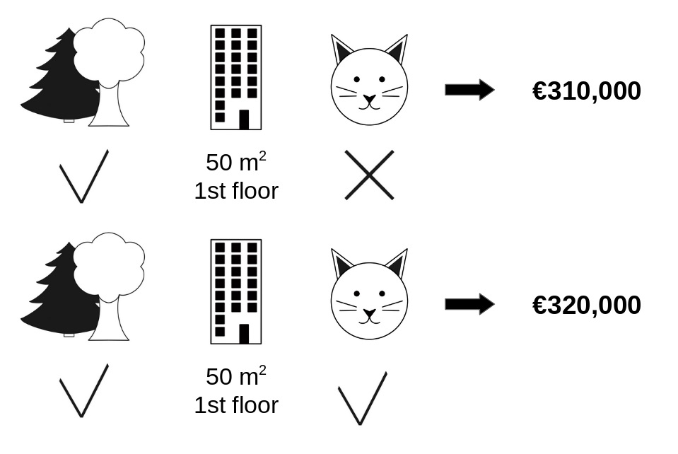

# INDEX
1. 개념 
    1-1. 게임이론
2. 특징 
    2-1. 효율성(Efficiency):
    2-2. 대칭성(Symmetry)
    2-3. 더미 특성(Dummy)
    2-4. 가법성(Additivity)

장단점 (크기가 커지면 복잡도가 급격히 증가 -> 실제 응용에선 근사치나 휴리스틱 알고리즘이 사용됨) 
3. 구현 
---
# 1. 개념 
## 1-1. 게임이론(Game Theory)
- 상호 의존적이고 이성적인 의사결정에 관한 수학적 이론 
- '본인 및 타인의 행위가 결과에 영향을 미치는 상황에서 최대 이익에 부합하는 행동을 추구한다'는 이론 연구 

## 1-2. shapley Value
- 게임이론 바탕
- 여러 특성들의 조합을 구성하고 해당 특성 유무에 따른 평균 변화를 통해 각 특성의 중요도 추출 

- cat-allowed 조건의 기여도를 확인하고 싶을 때 이 조건을 제외한 나머지 조건으로 조합 가능한 모든 조합에서의 평균 집값 구한 뒤 cat-allowed 조건 유무에 따른 평균 집값의 차이를 구함 
- 이런식으로 여러 조건들을 조합해 집값에 가장 큰 영향을 미치는 요인을 찾아 낼 수 있음 

# 2. 특징 
## 2-1. Efficiency(효율성)
- 각 특성의 기여도를 모두 더한 총합 = |예측치 - 평균| 
- 전체 예측치에 대한 각 특성의 기여도를 측정하는데 사용됨 
## 2-2. Symmetry(대칭성)
- 두개의 특성이 모든 조합에서 똑같이 기여한다면 shapley value도 동일
## 2-3. Dummy(더미특성)
- 예측치에 영향을 미치지 않는 변수의 shapley value는 0
## 2-4. Additivity(가법성)
- 각 게임에서 얻은 shapley value의 합은 전체 값과 동일 
- 각 특성의 개별적 기여도를 모두 더하면 전체 모델의 예측에 대한 shapley value가 나옴 