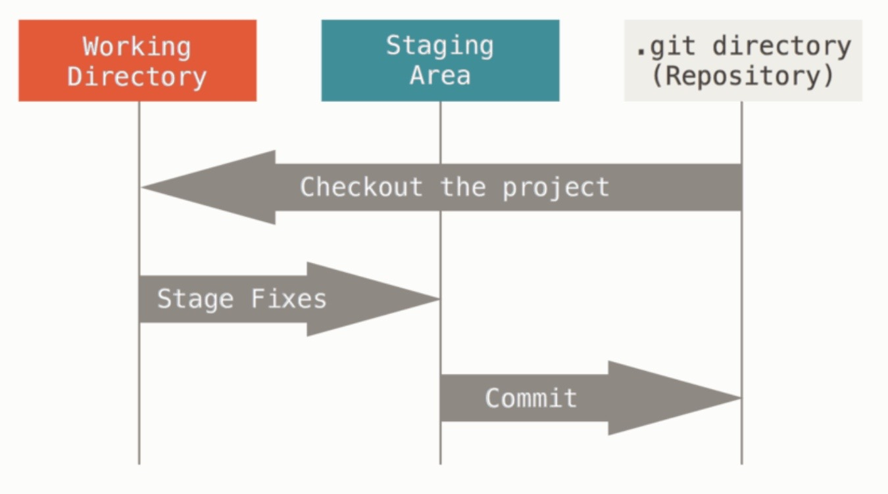

# basic command
> git 기본 문법 정리



- working directory - staging area : `add`
- staging area - .git directory : `commit`

## 초기 설정
- git을 설치 후 한번만 실행
```bash
git config --global user.email '이메일'
git config --global user.name '이름'
```

## git 저장소 만들기

- 