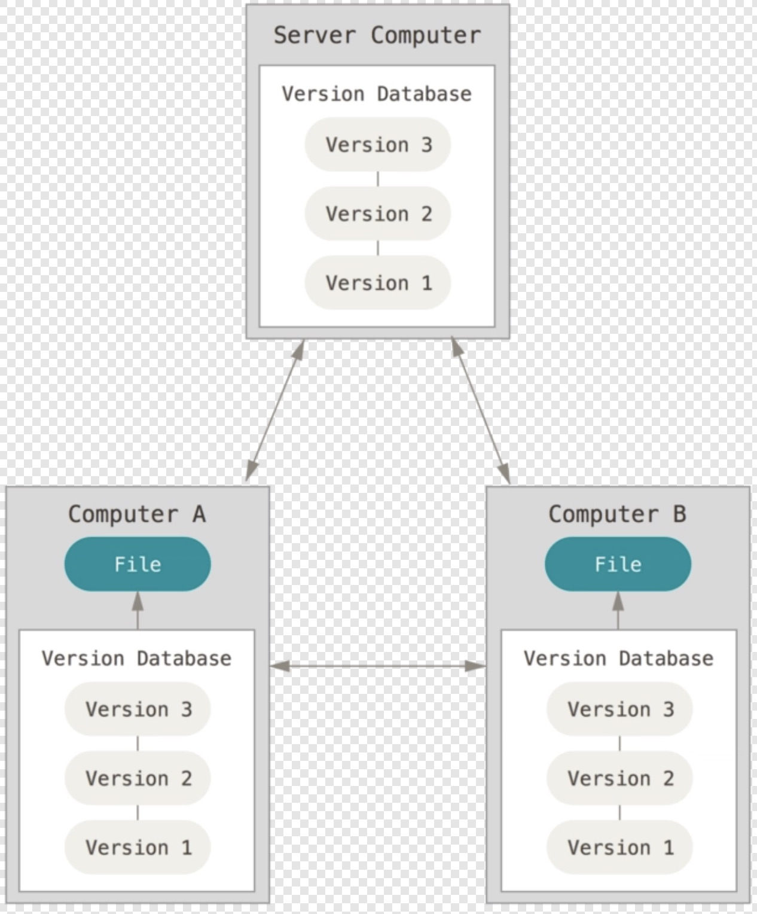
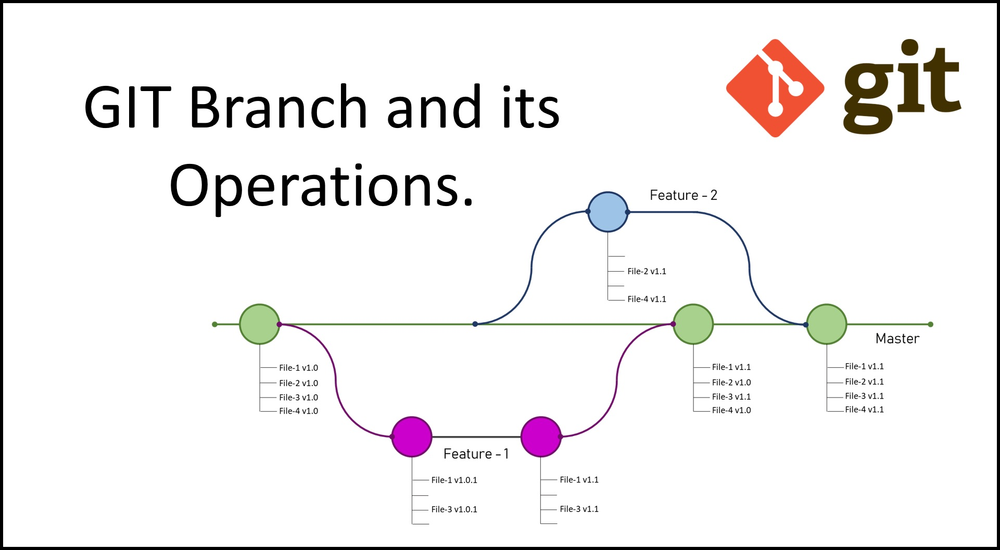

# git & github
## 1. git 
- **분산 버전 관리 시스템**
- 파일 변화를 시간에 따라 기록, 특정시점의 버전을 꺼내올 수 있게 함
- 다수의 개발자가 협업할때 충돌 최소화 가능
- 병렬 개발 가능

## 2. github

- 원격 저장소 중 하나이자 git repository를 관리할 수 있는 클라우드 기반 서비스
- 개발자들의 버전 제어 및 공동 작업을 위한 플랫폼

## 3. branch

- branch 시각화 사이트
    -  https://git-school.github.io/visualizing-git/

### 개념 
- 독립적인 개발라인
- 여러 작업을 각 독립된 공간에 진행하고 병합할 수 있음 

### 생성
- `git branch <브랜치이름>`
    - <브랜치이름>의 새로운 브랜치 생성
    - 새로 만든 브랜치는 작업하던 마지막 커밋을 가리킴
    - 브랜치를 이동하지 않음
- `HEAD`
    - git에서 지원하는 포인터
    - 현재 작업하는 로컬 브랜치 가리킴
### 이동
- `git branch checkout <브랜치이름>`
    - 작업하는 브랜치 이동(HEAD도 함께 바뀜)
- `git checkout -b <브랜치이름>`
    - 브랜치 생성과 동시에 이동가능
### 작업
- 새로 생성한 브랜치에서 `commit`을 하게 되면 `master`와 별개의 작업을 진행할 수 있음
- `git stash`
    - 진행 중인 작업을 스택에 잠시 저장
    - `git stash pop` 으로 다시 불러와 작업 가능
### 병합
- `git merge <브랜치이름>`
    - `master` 브랜치로 이동 후 작업 완료한 브랜치를 병합
### 충돌
- 서로 다른 브랜치에서 ***같은 파일을 수정***하고 `merge` 시도하면 충돌 발생
-   `git status`로 충돌된 파일 확인 후 작업자가 정리하여 `commit`

## 4. github 이용한 협업 방법

### 가져오기
- `fork` 이용해 내 저장소로 가져오기
- 터미널 창에 `git clone <레포지토리 주소>` 입력
    - clone 완료된 후 루트디렉토리(mac의 경우 사용자 폴더)에 생성된 폴더 확인
- 작업전 `remote` 설정
    - `git remote add <이름> <레포지토리 주소>` 

### 내보내기
- `git push origin <브랜치명>`
    - 작업한 내용을 원본저장소가 아닌 ***내 레포지토리***에 업로드
- `pull request`
    - push 완료 후 Pull requests 탭에서 활성화된 `compare & pull request` 버튼 클릭
    - 변경 사항과 같은 정보 기입 후 pull request 요청

### 병합
- `Merge pull request` 버튼으로 merge 진행
- merge 후 branch 삭제