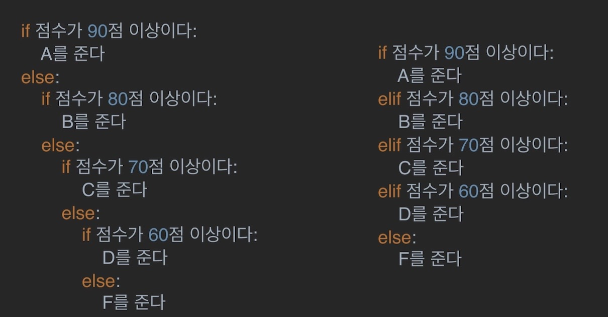

# 제어문
## 조건문(`if문`)
- if문은 반드시 참/거짓을 판단할 수 있는 조건식과 함께 사용
- 조건식이 참인 경우 : 이후의 문장 실행
- 조건식이 거짓인 경우 : else: 이후의 문장을 실행

### 01. `if` <조건식> : 
    if의 조건식이 참인 경우 실행하는 코드
        - if num % 2 == 1:
            print('홀수입니다.')
        - if num % 2:
            print('홀수입니다.')
        - 0, 1이 자동형변환이 일어나 `True`, `False`로 변환됨

### 02. `else`:
    if의 조건식이 거짓인 경우 실행하는 코드

## `elif`
- else + if를 의미하며 깔끔한 코드 작성 가능
 

if <조건식>:

    if 조건이 참인 경우 실행

elif <조건식>:
    
    elif 조건이 참인 경우 실행

...

else:

    위의 조건식에 하나도 부합하지 않는 경우 실행

