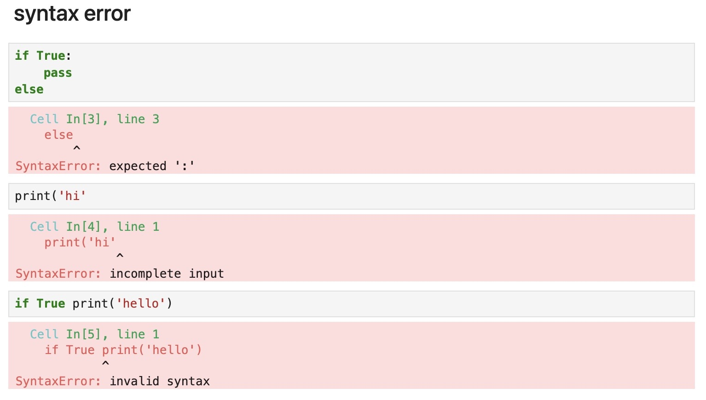

# Error
# INDEX
1. syntax error
2. exception
3. 예외처리

## 1. syntax error
- 파이썬 내부 문법에 어긋날 때 발생
    - `:`, `()`, `''` 등


## 2. exception
- `ZeroDivisionError`: 0으로 나눌 때 발생
- `NameError`: 정의되지 않은 함수나 변수 사용시 발생
- `TypeError`: 서로 다른 형태의 데이터 연산시, 함수 내 필수 요소 미정의 시 발생
- `ValueError`: 값이 알맞은 범위 내에 있지 않을 때 발생
- `IndexError`: 리스트 범위 밖의 요소를 사용시 발생
- `KeyError`: 사전에 없는 키 사용시 발생
- `ModuleNotFoundError`: 사용하려는 모듈이 없을 때 발생
- `KeyboardInterrupt`: 무한루프 강제 중지시 발생

## 3. 예외처리
```python
try:
    code
except 예외:
    code
```

- `try` + 실행하고자 하는 코드 입력
- `except` + 오류 발생시의 코드 입력
- `else` 
    - 예외를 일으키지 않을 때 실행되는 코드
    - `except`를 만나지 않고 끝까지 실행되었을 때 실행되는 코드
    - `for`문에서의 `else`와 유사
- `finally`
    - 예외 상황과 무관하게 무조건 최종적으로 실행되는 코드
- `raise`
    - 예외를 강제로 발생시켜야하는 상황에서 사용(코드테스트 등)