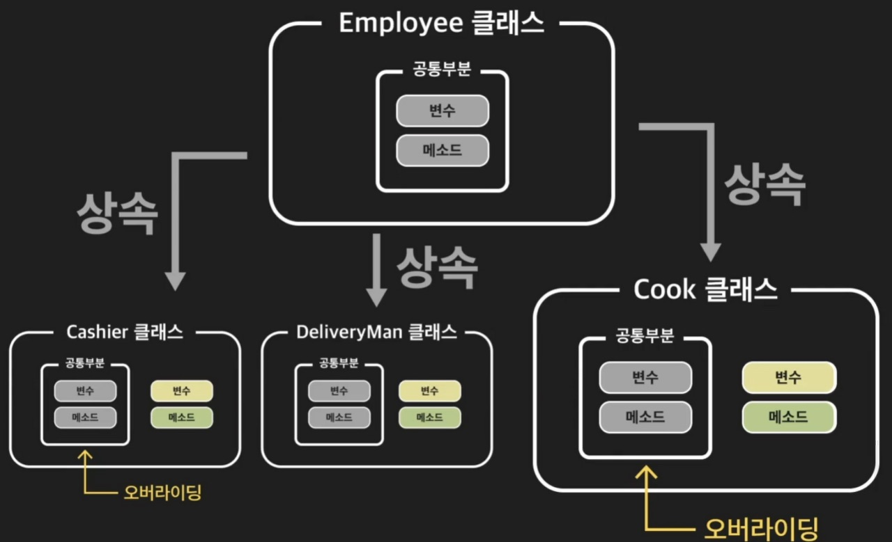
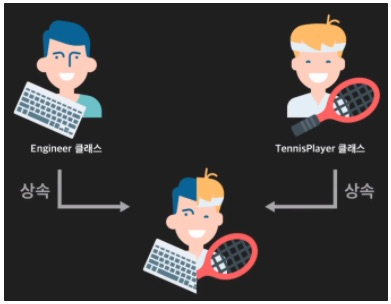

# 객체지향 프로그래밍(OOP)
# INDEX
1. 객체지향 프로그래밍
2. 클래스
    1. 클래스 선언
    2. 인스턴스화
3. 생성자와 소멸자
    1. 생성자
    2. 소멸자
4. 변수
    1. 클래스 변수
    2. 인스턴스 변수
5. 메소드
    1. class methon
    2. instance method
    3. static method
6. 상속
    1. 다중상속

# 1. 객체지향 프로그래밍
- 클래스(class): 같은 종류의 집단에 속하는 속성(attribute)와 행위(method)를 정의한 것
- 인스턴스(instance): 클래스를 실제로 메모리상에 할당한 것
- 속성(attribute): 클래스/인스턴스가 가지고 있는 **데이터**/값
- 행위(method): 클래스/인스턴스가 가지고 있는 **함수**/기능

# 2. 클래스
## 2-1. 클래스 선언
```python
class ClassName:
    attribute = value
    #속성에 대한 값 입력

    def method_name(self):
        code
```

## 2-2. 인스턴스화
```python
ClassName()
```

# 3. 생성자와 소멸자

## 3-1. 생성자
```python
class MyClass:
    def __init__(self):
        pass
```
- 객체가 생셩될 때 자동으로 호출되는 method

## 3-2. 소멸자
```python
class MyClass:
    def __del__(self):
        pass
```
- 객체 참조 제거(가비지 수집)
- 불필요한 객체를 삭제해 메모리공간 확보
# 4. 변수
## 4-1. 클래스 변수
- 클래스 선언 블록 최상단에 위치

## 4-2. 인스턴스 변수
- 인스턴스 내부에서 생성한 변수(self.variable = )

```python
class MyClass:
    calss_variable = '클래스변수'

    def __init__(self, name):
        self.instance_variable = '인스턴스변수'
```

# 5. 메소드
```python
class MyClass:
    def instance_method(self):
        pass

    @classmethod
    def class_method(cls):
        pass

    @staticmethod
    def static_method():
        pass
```
## 5-1. class method
- 클래스에 있는 데이터를 사용하고 싶을 때 사용

## 5-2. instance method
- 거의 대부분의 변수는 인스턴스메소드 사용

## 5-3. static method
- 인스턴스나 클래스의 데이터를 사용하지 않을 때 사용

# 6. 상속
- 부모의 정보를 그대로 가지고 오는 것
- 상위 클래스의 정보를 또 입력해야하는 번거로움을 줄일 수 있음

 

## 6-1. 다중상속
- 다수개의 부모 클래스를 자식 클래스에 상속
- 우선순위는 앞에 있는 클래스

 