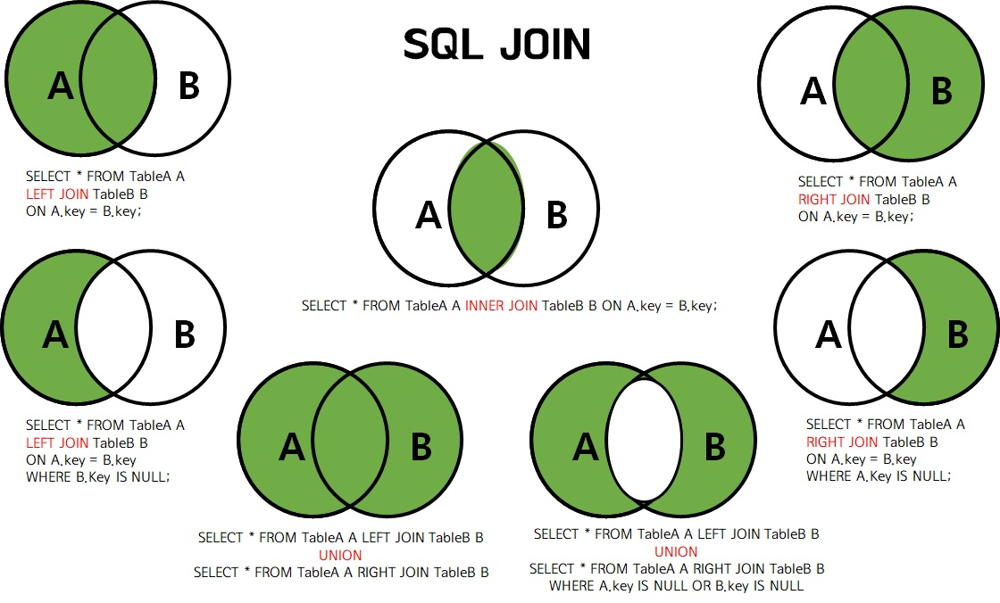

INDEX
1. JOIN
    1. INNER JOIN
    2. OUTER JOIN 
2. CASE WHEN
3. SUBQUERY
    1. SCALAR SUBQUERY
    2. INLINE VIEW
    3. NESTED SUBQUERY
4. UNION & UNION ALL
    1. UNION 
    2. UNION ALL 
5. WITH ROLLUP
6. WINDOW FUNCTION
---

# 1. `JOIN`
- 두 개의 테이블을 하나로 묶음 
- `INNER JOIN`, `OUTER JOIN`, `CROSS JOIN`, `SELF JOIN`이 있음 
- 두 테이블에 같은 컬럼이 있으면 어떤 테이블의 컬럼인지 `.`앞에 적어줘야함
- `alias` 지정시 on절에서 사용해야함  


## 1-1 `INNER JOIN`
- 교집합에 해당(두 테이블에서 공통된 데이터만 반환)
- `inner join`이 아닌 `join`으로 입력해도 정상 작동 
- join 조건관 filtering 조건을 and로 연결해 where절에 명시 가능 
- 사용 예시 
```sql
-- 표준방식 
select 별칭1.컬럼명1, 별칭1.컬럼명2 from 테이블1 별칭1 inner join 테이블명2 별칭2 on 별칭1.컬럼명1 = 별칭2.컬럼명2;

-- 실무방식
select 별칭1.컬럼명1 from 테이블1 별칭1, 테이블2 별칭2 where 별칭1.컬럼명1 = 별칭2.컬럼명1;

-- join 조건과 filtering 조건 함께 사용 
select 별칭1.컬럼명 from 테이블1 별칭1, 테이블2 별칭2 where 별칭1.컬럼명1 = 별칭2.컬럼명1 and 조건 
```

## 1-2 `OUTER JOIN`
- 데이터가 있는 테이블을 기준으로 데이터가 없는 테이블에서 매치되는 데이터를 가져오는 방법
- 기준에 따라 `left outer join`과 `right outer join`으로 나뉨
- 사용 예시 
```sql
-- left outer join
select * from 테이블1 별칭1 left outer join 테이블2 별칭2 on 별칭1.컬럼명1 = 별칭2.컬럼명2;

-- left outer join + where 이용해 inner join 결과 도출 
select * from 테이블1 별칭1 right outer join 테이블2 별칭2 on 별칭1.컬럼명1 = 별칭2.컬럼명1 where 별칭2.컬럼명1 is not null;

-- right outer join
select * from 테이블1 별칭1 right outer join 테이블2 별칭2 on 별칭1.컬럼명1 = 별칭2.컬럼명1;
```

# 2. `CASE WHEN`
- select절에 사용되며 `if then else`와 유사
- 단순케이스 문법식과 검색케이스 문법식이 있음 
    - 단순케이스 문법식 : equal 조건식만 가능 
    - 검색케이스 문법식 : 범위조건 가능 
- 마지막 else 생략시 그 외의 값들은 null로 반환 
- 사용 예시 
```sql 
-- 단순케이스 문법식 
select 컬럼1, case 컬럼2 when 값1 then 값2 when 값3 then 값4 else 값5 end as 별칭 from 테이블명;

-- 검색케이스 문법식 
-- 범위 조건 적용 가능(다중범위도 가능: 앞에 있는 범위가 우선순위 가짐) 
select 컬럼1, case when 컬럼2 = 값1 then 값2 when 컬럼2 = 값2 then 값3 else 값4 end as 별칭 from 테이블1;
```

# 3. `SUBQUERY`
- 메인쿼리 안에 있는 또 하나의 쿼리를 의미하며 여러개 사용 가능 
- `SELECT`, `FROM`, `WHERE`, `HAVING`, `ORDER BY`, `VALUES(INSERT)`, `SET(UPDATE)`에 사용 가능 
- 반환하는 데이터에 따라 단일행, 다중행, 다중컬럼 서브쿼리로 나뉨
- 메인쿼리와의 연관성에 따라 연관 서브쿼리, 비연관 서브쿼리로 나뉨

## 3-1. `SCALAR SUBQUERY`
- `select` 절에 사용되는 서브쿼리 
- 하나의 값이 출력되도록 작성해야함 
```sql
-- 연관 스칼라 서브쿼리
select 별칭1.컬럼1, 별칭1.컬럼2,
        (select 별칭2.컬럼2 from 테이블2 별칭2 where 별칭2.컬럼3 = 별칭1.컬럼3) as 별칭
from 테이블1 별칭1

-- 비연관 스칼라 서브쿼리
select 별칭1.컬럼1, 별칭1.컬럼2,
        (select 별칭2.컬럼2 from 테이블2 별칭2 where 별칭2.컬럼2 = 1) as 별칭
from 테이블1 별칭1
```

## 3-2. `INLINE VIEW`
- `from` 절에 사용되는 서브쿼리
- 테이블로 존재하지 않는 가상의 데이터를 조인할 때 유용(조인 조건에 사용된 컬럼 꼭 인라인뷰에 기재)
- INLINE VIEW: 테이블 대용, SCALAR SUBQUERY: 컬럼 대용
- 사용 예시
```sql
-- 인라인뷰 사용시
select 별칭1.컬럼1, 별칭1.컬럼2, 별칭2.컬럼3
from 테이블1 별칭1, 
    (select 컬럼1, 컬럼3
    from 테이블2
    where 별칭1.컬럼1 = 별칭2.컬럼1) 별칭2;

-- 일반조건 사용시
select 별칭1.컬럼1, 별칭1.컬럼2, 별칭2.컬럼3
from 테이블1 별칭1, 테이블2 별칭2
where 별칭1.컬럼1 = 별칭2.컬럼1;

-- 가상의 데이터를 인라인뷰로 조인 
select tmp.hello, t1.name
from (select '안녕!' as hello from dual) tmp, table1 t1;
```

## 3-3. `NESTED SUBQUERY`
- `where`, `having`과 같은 조건절에 사용 
- 메인 쿼리와 비교시 사용 
- 리턴되는 값의 수에 따라 단일 서브쿼리와 다중 서브쿼리로 나뉨
    - 단일 서브쿼리: 서브쿼리에서 리턴되는 값이 하나일 때, equal 조건 사용 가능
    - 다중 서브쿼리: 서브쿼리에서 리턴되는 값이 두개 이상일 때, in 사용 가능
- 사용 예시 
```sql
-- 단일 서브쿼리
select * from 테이블1 별칭1
where 별칭1.컬럼1 = (select 별칭2.컬럼1 from 테이블2 별칭2 where 조건);

-- 다중 서브쿼리
select * from 테이블1 별칭1
where 별칭1.컬럼1 in (select 별칭2.컬럼1 from 테이블2 별칭2 where 조건);
```

# 4. `UNION` & `UNION ALL`
- 서로 다른 두 쿼리의 결과 세트를 연결 
- join: 데이터 연산 방향이 가로 / 집합연산자: 데이터 연산 방향이 세로
- 오라클의 교집합(intersect), 차집합(minus)을 지원하지 않음 
- `UNION`, `UNION ALL` 사용시 `select`절에 있는 컬럼의 수가 일치해야함(순서는 달라도 됨)
- 두 쿼리의 별칭이 다를 때 먼저 쓰인 테이블의 별칭이 결과로 나옴

## 4-1. `UNION`
- 중복 데이터 제거 
- 중복을 제거하기 때문에(추가적인 일을 하므로) 데이터의 크기가 크면 속도저하가 발생할 수 있음 

## 4-2. `UNION ALL`
- 데이터의 중복 허용

```sql
-- union 
select * from 테이블1
union 
select * from 테이블2
order by 컬럼1;

-- union all
select * from 테이블1
union all 
select * from 테이블2

-- intersect(교집합 구현)
select * from 테이블1 별칭1
where exists (select 1 from 테이블2 별칭2 where 별칭1.컬럼1 = 별칭2.컬럼1);

-- minus(차집합 구현)
select * from 테이블1 별칭1
where not exists (select 1 from 테이블2 별칭2 where 별칭1.컬럼1 = 별칭2.컬럼1);
```

# 5. `WITH ROLLUP`
- `group by`를 이용해 묶은 컬럼들의 소계 및 총합계를 구할 때 사용
- 유사한 함수로는 `CUBE`, `GROUPING SETS`가 있음 
- 소계의 명을 null 이외의 값으로 지정시 `case when` 구문 사용
- `group by` 컬럼 순서에 따라 소계 기준도 바뀜 
- 사용 예시
```sql
-- 기본, 먼저 기입된 컬럼에 대한 소계 반환
select 컬럼1, 컬럼2, count(*) from 테이블1 group by 컬럼1, 컬럼2 with rollup;

-- case when 구문 사용
select case when 컬럼1 is null then '값1' else 컬럼1 end as 컬럼1, case when 컬럼2 is null then '값2' else 컬럼2 end as 컬럼2, count(*)
from 테이블1 
group by 컬럼1, 컬럼2 with rollup;
```

# 6. `WINDOW FUNCTION`
- 행과 행간의 관계를 쉽게 정의
- 테이블 전체가 아닌 특정 부분에 대한 계산을 해줌 
- `OVER`절 사용 
- 기본집계함수, 순위결정함수 등이 포함됨 
    - 기본집계함수: Etc1.md 참고
    - 순위결정함수
        - `row number`: 동일 값 있더라도 모두 다른 순위로 반환(ex. 1,2,3,4)
        - `rank`: 동일 값을 같은 순위로, 다음 순위는 그 수만큼 건너뛰기 (ex. 1,2,2,4)
        - `dense rank`: 동일 값을 같은 순위로, 건너뛰지 않음 (ex. 1,2,2,3)
- 사용 예시 
```sql
-- 기본 형태
윈도우함수 OVER (partition by 컬럼명, order by 컬럼명)

-- 집계함수 사용
select 컬럼1, count(*) over (partition by 컬럼1) as 별칭1 from 테이블1;

-- 순위 
select 컬럼1, 컬럼2, 컬럼3, 컬럼4
        row_number() over (partition by 컬럼2 order by 컬럼3 desc) as 별칭1,
        rank() over (partition by 컬럼2 order by 컬럼3 desc) as 별칭2,
        dense_rank() over (partition by 컬럼2 order by 컬럼3 desc) as 별칭3
from 테이블1
order by 컬럼2
```