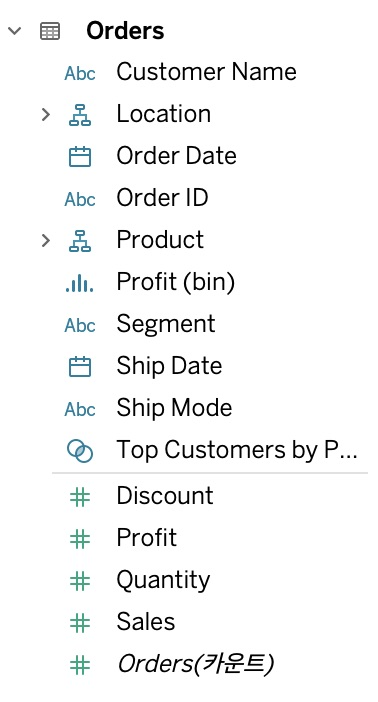

INDEX
1. 차원과 측정값
2. 연속형과 불연속형
3. Row-level 계산과 Aggegate-level 계산

---
# 1. 차원과 측정값 
- 차원 
    - 범주형 데이터
    - 나눠서 볼 기준(지역별, 연도별, 성별)
    - 숫자를 자르는 기준
- 측정값 
    - 수치형 데이터
    - 값(매출, 수익, 배송비)
- 수치형 데이터인 측정값은 차원으로 쪼개지며 의미를 가짐 
- 차원이 없다면 하나의 덩어리만 표시됨 

# 2. 연속형과 불연속형 

- 연속형
    - 초록색
    - 연속적 순서가 있는 쭉 이어진 데이터(축 모양)
    - 오름/내림차순 정렬 불가
- 불연속형
    - 파란색
    - 개별적으로 구분되는 데이터(각각의 유니크한 헤더)
    - 오름/내림차순 정렬 가능

# 3. Row-level 계산과 Aggegate-level 계산
- Row-level 계산
    - 데이터셋의 행 단위로 계산
    - 각 행별로 계산한 뒤에 그 결과에 대한 합계 반환 -> 부정확
- Aggegate-level 계산
    - 현재 뷰의 세부 수준에 따라 집계 후에 계산 
    - 열방향의 합계를 구한뒤 그 값으로 계산 -> 정확